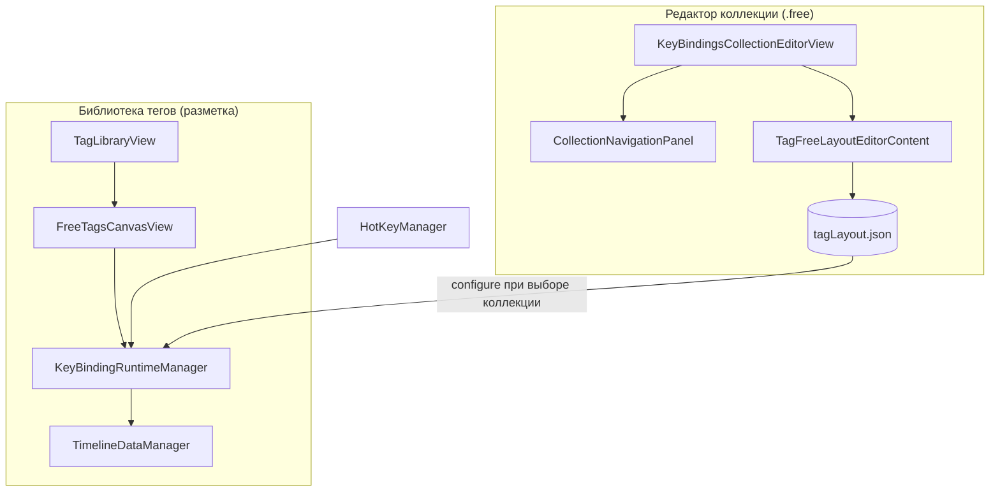

# Связки клавиш, библиотека тегов и редактор коллекций

Документация по режиму **«Связки клавиш»** (свободная раскладка на холсте), редактору коллекций и поведению библиотеки тегов при разметке видео.

> Общая документация по разметке (таймлайн, штампы, видео, SportCut, экспорт): [MARKUP.md](./MARKUP.md).

---

## Содержание

1. [Обзор](#обзор)
2. [Типы коллекций](#типы-коллекций)
3. [Создание и редактирование коллекций](#создание-и-редактирование-коллекций)
4. [Редактор коллекции «Связки клавиш»](#редактор-коллекции-связки-клавиш)
5. [Редактор стандартной коллекции](#редактор-стандартной-коллекции)
6. [Типы связок](#типы-связок)
7. [Поведение при разметке (runtime)](#поведение-при-разметке-runtime)
8. [Лейблы](#лейблы)
9. [Библиотека тегов](#библиотека-тегов)
10. [Горячие клавиши](#горячие-клавиши)
11. [Хранение данных](#хранение-данных)
12. [Архитектура (для разработчиков)](#архитектура-для-разработчиков)

---

## Обзор

В YouChip-Stat пользовательские коллекции тегов могут работать в двух режимах отображения:

| Режим | Внутреннее имя | Библиотека тегов |
|-------|----------------|------------------|
| **Стандартная** | `grouped` | Список групп тегов, лейблы через модальное окно |
| **Связки клавиш** | `free` | Свободный холст с кнопками тегов, лейблов и событий |

Режим **«Связки клавиш»** добавляет:

- **Свободную раскладку** — позиции, формы и стили кнопок на виртуальном холсте.
- **Связки (bindings)** — правила «нажал A → произошло B» между кнопками холста.
- **Runtime-движок** — `KeyBindingRuntimeManager` обрабатывает нажатия во время разметки.

Каждая кнопка на холсте имеет составной ключ: `tag:<id>`, `label:<id>` или `timeEvent:<id>`.

---

## Типы коллекций

### Стандартная (`grouped`)

- Теги сгруппированы в **группы** и отображаются списком.
- Лейблы привязаны к тегам через поле `lablesGroup` (какие группы лейблов доступны для тега).
- При нажатии на тег с привязанными группами лейблов открывается **лист выбора лейблов**.
- Горячие клавиши тегов регистрируются через `HotKeyManager`.
- Карта поля (field map) может открываться при добавлении тега.

### Связки клавиш (`free`)

- Теги, лейблы и общие события размещаются на **холсте** в произвольных координатах.
- Между кнопками настраиваются **связки** с типами (подсветка, активация, видимость и т.д.).
- При сохранении коллекции **все теги автоматически связываются со всеми группами лейблов** — отдельная привязка лейбл-групп к тегу в редакторе скрыта.
- Библиотека тегов показывает холст только если существует файл раскладки `tagLayout.json`. Иначе коллекция временно отображается как стандартная до первого сохранения редактора.
- При добавлении тега с холста карта поля **не открывается** (`useFieldMap: false`).

Режим хранится в метаданных коллекции: `CollectionInfo.tagLibraryDisplayMode` в `CollectionsBookmarks.json`.

---

## Создание и редактирование коллекций

### Создание

1. Меню **Коллекции** → **Создать новую коллекцию**.
2. Выбрать тип: **Стандартная** или **Связки клавиш**.
3. `WindowsManager.openCustomCollectionsWindow` открывает нужный редактор:
   - `.free` → `KeyBindingsCollectionEditorView`
   - `.grouped` → `CreateCustomCollectionsView`

Окно редактора открывается на весь экран. При открытии отправляется уведомление `.collectionEditorOpened`.

### Редактирование существующей

Тип коллекции читается из закладок (`CollectionsBookmarksManager`). Маршрутизация та же, что при создании.

### Сохранение

При сохранении коллекции «Связки клавиш»:

1. Сохраняются JSON-файлы коллекции (теги, группы, лейблы, события, карта).
2. Вызывается `syncKeyBindingsLabelGroupLinks()` — все теги получают ссылки на все группы лейблов.
3. Сохраняется `tagLayout.json` (позиции элементов + массив связок).
4. Отправляется `.collectionDataChanged` — библиотека тегов подхватывает изменения.

---

## Редактор коллекции «Связки клавиш»

Полноэкранный редактор `KeyBindingsCollectionEditorView` — три панели:

```
┌──────────────────────────────────────────────────────────────────┐
│  Панель инструментов: название | Сохранить | Экспорт | Сброс    │
├─────────────┬────────────────────────────┬───────────────────────┤
│ Навигация   │ Центральный холст          │ Настройки элемента    │
│ (300–360px) │                            │ (340px)               │
│ сворачивается│                           │ скрыта на вкладке Map │
└─────────────┴────────────────────────────┴───────────────────────┘
```

### Левая панель — `CollectionNavigationPanel`

Вкладки:

| Вкладка | Содержимое | Центральная панель |
|---------|------------|-------------------|
| **Теги** | Группы тегов, создание/редактирование/удаление, захват hotkey | Холст |
| **Лейблы** | Группы лейблов, inline-создание (сразу на холсте) | Холст |
| **События** | Общие временные события, переименование | Холст |
| **Карта** | Статус карты поля | `CollectionFieldMapEditorView` (на весь центр) |

Действия:

- **+ Создать группу** — новая группа тегов или лейблов.
- **+ Добавить тег** — попап создания (`CollectionTagEditorSheets`).
- **+ Добавить лейбл** — inline-поле имени; лейбл сразу появляется на холсте.
- Карандаш у тега — редактирование (имя, цвет, интервал, hotkey и т.д.).
- Удаление — с подтверждением.

Панель можно свернуть в узкую полоску.

### Центральный холст — `TagFreeLayoutEditorContent`

Два режима (переключатель в тулбаре):

#### Режим «Раскладка»

- Перетаскивание, изменение размера, поворот элементов.
- Сетка и привязка к сетке.
- Визуальные настройки: форма, заливка, обводка, шрифт, тень, порядок слоёв.

Поддерживаемые формы: квадрат, круг, треугольник, звезда, ромб, шестиугольник, капсула.

#### Режим «Связки»

1. Нажать **источник** (подсвечивается «1»).
2. Нажать **цель**.
3. Создаётся связка по умолчанию типа **Подсветка**.
4. На стрелке между кнопками — бейдж с количеством связок; клик по стрелке открывает настройки справа.

Контекстное меню на холсте в режиме связок:

- Копировать все исходящие связки кнопки.
- Вставить из буфера (`KeyBindingClipboard`).

Палитра справа (`KeyBindingSettingsPanel`): можно перетащить лейбл или событие на холст.

### Правая панель

- В режиме **Раскладка** — внешний вид выбранного элемента.
- В режиме **Связки** — `KeyBindingSettingsPanel`: тип связки, задержка, переопределение времени тега, опции подсветки, дублирование/удаление.

### Тулбар

- **Сохранить / Обновить** — коллекция + `tagLayout.json`.
- **Экспорт** — экспорт коллекции.
- **Сброс раскладки** — дефолтная сетка для тегов (лейблы не добавляются автоматически).

---

## Редактор стандартной коллекции

`CreateCustomCollectionsView` — классический редактор:

- Боковая навигация по разделам (теги, лейблы, события, карта).
- Сегментированные вкладки.
- Per-tag привязка групп лейблов.

Для legacy-коллекций с `displayMode == .free`, открытых через старый путь, доступна кнопка **«Отображение»** с sheet-редактором раскладки. Новые коллекции «Связки клавиш» всегда открываются в `KeyBindingsCollectionEditorView`.

---

## Типы связок

Определены в `KeyBindingType` (`KeyBindingModels.swift`). Между одной парой кнопок может быть **несколько связок**; они выполняются по порядку, с опциональной задержкой `delaySeconds`.

### Подсветка (`highlight`)

- Включает режим подсветки: целевая кнопка получает **жёлтую обводку**.
- Остальные кнопки остаются кликабельными.
- Если в связке участвует тег — запоминается `anchorTagId`.
- Опции:
  - `showTargetOnHighlight` — показать/скрыть цель при подсветке.
  - `highlightHotkey` — горячая клавиша для нажатия подсвеченной кнопки без мыши.
  - `revertVisibilityAfterPress` — вернуть видимость после нажатия цели.
- Сброс: **Esc** или завершение пары (см. ниже).

### Активация (`activation`)

| Цель | Действие |
|------|----------|
| **Тег** | Добавить штамп на таймлайн (или начать интервальный тег). Опционально `overrideTimeBefore` / `overrideTimeAfter`. После добавления — каскад исходящих связок с этого тега. |
| **Лейбл** | Активировать лейбл (`activatedLabelIds`) — как Cmd+клик. |
| **Событие** | Добавить в `pendingTimeEventIds` (прикрепятся к следующему штампу). |

### Деактивация (`deactivation`)

- Для интервального тега — **остановить запись** (`onStopIntervalTag`).

### Инверсия интервала (`intervalInversion`)

- Если интервальный тег **зажат** — отжать.
- Если **отжат** — зажать и выполнить исходящие связки с него.

> Связки типа activation/deactivation/intervalInversion срабатывают только при **активации** (зажатии), не при отжатии интервального тега.

### Видимость (`visibility`)

- Сделать кнопку видимой (`runtimeVisibility[key] = true`).
- Опционально `revertVisibilityAfterPress` — скрыть снова после следующего нажатия на эту кнопку.

### Невидимость (`invisibility`)

- Скрыть кнопку. Опционально revert после нажатия.

### Инверсия видимости (`visibilityInversion`)

- Переключить видимость относительно значения в раскладке или текущего runtime-оверрайда.

### Эксклюзивная (`exclusive`)

**Тег ↔ Тег:**

- При активации источника — деактивировать (отжать) целевой интервальный тег.
- При деактивации источника — активировать целевой интервальный тег.

**Тег ↔ Лейбл:**

- Работает как **парная подсветка**: нажали одного партнёра → подсветился второй → нажали второго → **тег + лейбл добавляются вместе** одним штампом.
- Работает в обе стороны:
  - **Лейбл → Тег** → штамп с тегом и лейблом.
  - **Тег → Лейбл** → тег **не добавляется** после первого нажатия; ждём лейбл; затем один штамп с тегом и лейблом.
- Если у лейбла есть хотя бы одна эксклюзивная связь — для этого лейбла действуют **только** связки типа `exclusive` (остальные фильтруются).

---

## Поведение при разметке (runtime)

Движок: `KeyBindingRuntimeManager` (синглтон). Подключается из `TagLibraryView` через `wireRuntimeCallbacks()` при первом нажатии на холсте.

### Схема обработки нажатия

```
Нажатие кнопки на холсте
        │
        ▼
handleButtonTap(kind, elementId)
        │
        ├─► Интервальный тег уже активен? → только остановка, без связок
        │
        ├─► tryCompleteHighlightPair → пара завершена? → тег+лейбл / тег с лейблами
        │
        ├─► applyOutgoingBindings (исходящие связки, с каскадом и задержками)
        │
        └─► applyIncomingTagLabelExclusiveBindings (если подсветка ещё не активна)
```

### Пары подсветки (тег ↔ лейбл)

1. Первое нажатие (источник) — `.highlight` или `.exclusive` тег↔лейбл подсвечивает партнёра.
2. Второе нажатие на подсвеченного партнёра завершает пару:

| Порядок | Результат |
|---------|-----------|
| Лейбл → Тег | `onAddTag` с накопленными активированными лейблами |
| Тег → Лейбл | `onAddTag` с лейблом-партнёром (тег не добавлялся ранее) |

3. **Esc** — сброс подсветки без добавления (`resetHighlight`).

### Теги на холсте

**Обычный (мгновенный) тег:**

1. Пауза видео.
2. Обработка связок.
3. Если ждём партнёра после нажатия тега (`isWaitingForTagLabelPartner`) — **штамп не создаётся**.
4. Если ждём тег после нажатия лейбла (`highlightOriginIsLabel`) — **штамп не создаётся**.
5. Иначе — `addTagToTimeline` с активированными лейблами.

**Интервальный тег:**

- Первое нажатие — начало записи (без паузы видео в режиме связок).
- Второе нажатие — окончание; эксклюзивные связки тег↔тег применяются **до** завершения записи.
- Связки при **старте** интервала; при **остановке** исходящие связки не выполняются (кроме `applyExclusiveOnTagDeactivation`).

### События на холсте

1. Пауза видео.
2. Связки.
3. Если не в режиме подсветки — переключение `pendingTimeEventIds` (выбор/снятие).
4. Pending-события прикрепляются к штампу при добавлении тега через `effectiveTimeEventsForStamp()`.

### Видимость в runtime

`runtimeVisibility` переопределяет `TagFreeLayoutItem.isVisible`. Скрытые элементы не отображаются на холсте. Revert-on-press срабатывает при следующем нажатии на кнопку.

---

## Лейблы

Поведение **только в режиме «Связки клавиш»** (`tagDisplayMode == .free`). В стандартном режиме лейблы выбираются через модальное окно после нажатия тега.

### Отображение на холсте

- Кнопки лейблов: `FreeLabelRuntimeItemView`.
- **Жёлтая обводка** — режим подсветки (ждёт пару).
- **Accent-обводка** — лейбл активирован (Cmd+клик).

### ЛКМ (обычный клик)

| Ситуация | Действие |
|----------|----------|
| Лейбл уже активирован | Деактивировать |
| Завершена пара подсветки | Ничего дополнительно |
| Лейбл подсветил тег, ждём тег | Ничего (ждём тег) |
| Есть исходящая связка activation→тег | Только связки, без привязки к последнему штампу |
| Ждём лейбл после нажатия тега | Ничего (завершение пары обработано в runtime) |
| Иначе | **Прикрепить лейбл к последнему штампу** на выбранной линии таймлайна |

Видео при клике по лейблу **не ставится на паузу**.

### Cmd+ЛКМ

- Переключить активацию лейбла.
- При активации — также выполнить исходящие связки.
- Активированные лейблы накапливаются и передаются в следующий добавленный тег (`takeActivatedLabels`).

### Связь тегов и групп лейблов

В режиме связок при сохранении коллекции `CustomCollectionManager.syncKeyBindingsLabelGroupLinks()` проставляет **всем тегам все группы лейблов**. Секция выбора групп лейблов в редакторе тега скрыта (`CollectionTagEditorSheets`).

---

## Библиотека тегов

`TagLibraryView` — панель разметки во вкладке Markup.

### Переключение режима отображения

`applyCollectionDisplayMode()`:

- Читает `tagLibraryDisplayMode` из закладки коллекции.
- Для `.free` проверяет наличие `tagLayout.json` (`isFreeLayoutConfigured`).
- Загружает раскладку в runtime: `reloadKeyBindingRuntimeLayout()` → `KeyBindingRuntimeManager.configure(layout:)`.

### Стандартный вид (`groupedModeBody`)

- Секция общих событий (чекбоксы).
- Секция групп тегов (аккордеон).
- Нажатие тега → пауза → лист лейблов / карта / добавление на таймлайн.

### Свободный вид (`freeTagsSection`)

- `FreeTagsCanvasView` на весь доступный размер.
- Масштаб холста — поповер в заголовке (`tagLibraryScale`).
- Прокрутка, авто-подгонка под размер панели (`TagLibraryFreeLayoutFitStore`).

### Обработчики нажатий

| Обработчик | Назначение |
|------------|------------|
| `handleCanvasButtonTap` | Теги и события |
| `handleCanvasLabelTap` | Лейблы (LMB / Cmd+LMB) |

Оба работают только при `isKeyBindingsCanvasMode && !isEditorModeActive`.

### Смена коллекции

При `loadUserCollection`:

1. Загружаются теги, лейблы, события.
2. `keyBindingRuntime.reset()` — сброс состояния подсветки.
3. `applyCollectionDisplayMode()` — перезагрузка связок из `tagLayout.json`.

`FreeTagsCanvasView` также перезагружает раскладку при смене `currentCollectionId`.

---

## Горячие клавиши

| Клавиша | Контекст | Действие |
|---------|----------|----------|
| **Hotkey тега** | Любой режим | Добавление тега (через `HotKeyManager`) |
| **Esc** (keyCode 53) | Режим связок, активна подсветка | `resetHighlight()` — сброс подсветки |
| **highlightHotkey** связки | Подсветка активна | Симуляция нажатия подсвеченной кнопки |

Hotkey тега настраивается в левой панели редактора (inline-захват). Hotkey подсветки — в настройках связки типа `highlight`.

---

## Хранение данных

### Пути (относительно `~/Documents/YouChip-Stat/`)

| Файл / папка | Содержимое |
|--------------|------------|
| `CollectionsBookmarks.json` | Список коллекций, id, имя, `tagLibraryDisplayMode` |
| `Collections/{collectionId}/` | Папка коллекции |
| `Collections/{collectionId}/tagLayout.json` | Холст + связки |
| `Collections/{collectionId}/tags.json` | Теги |
| `Collections/{collectionId}/tagGroups.json` | Группы тегов |
| `Collections/{collectionId}/labels.json` | Лейблы |
| `Collections/{collectionId}/labelGroups.json` | Группы лейблов |
| `Collections/{collectionId}/timeEvents.json` | Общие события |
| `Collections/{collectionId}/playField.json` | Карта поля |

Резервная копия синхронизируется в `~/Library/Application Support/YouChip-Stat-Backup/` через `DataSyncManager`.

### Схема `tagLayout.json`

```json
{
  "canvasWidth": 1000,
  "canvasHeight": 800,
  "items": [
    {
      "elementId": "<uuid>",
      "kind": "tag",
      "center": { "x": 200, "y": 150 },
      "size": { "width": 180, "height": 70 },
      "rotation": 0,
      "shape": "square",
      "isVisible": true
    }
  ],
  "bindings": [
    {
      "id": "<uuid>",
      "sourceId": "<tag-uuid>",
      "sourceKind": "tag",
      "targetId": "<label-uuid>",
      "targetKind": "label",
      "type": "exclusive"
    }
  ]
}
```

`TagFreeLayoutStorage.normalizeLayout` при загрузке:

- Удаляет элементы и связки для удалённых сущностей.
- Автоматически добавляет на сетку **новые теги** (лейблы и события — только вручную).

---

## Архитектура (для разработчиков)

### Диаграмма



### Ключевые файлы

**Модели**

| Файл | Назначение |
|------|------------|
| `Models/KeyBindingModels.swift` | `CanvasButtonKind`, `KeyBindingType`, `KeyBinding` |
| `Models/TagFreeLayout.swift` | `TagFreeLayout`, `TagFreeLayoutItem`, формы и стили |
| `Models/VideoPlayerModels.swift` | `CollectionTagLibraryDisplayMode`, `Tag`, `Label` |

**Менеджеры**

| Файл | Назначение |
|------|------------|
| `Managers/KeyBindingRuntimeManager.swift` | Runtime-движок связок |
| `Managers/TagFreeLayoutStorage.swift` | Загрузка/сохранение/нормализация раскладки |
| `Managers/TagLibraryFreeLayoutFitStore.swift` | Кэш масштаба подгонки холста |
| `Managers/KeyBindingClipboard.swift` | Буфер копирования связок |
| `Managers/CustomCollectionManager.swift` | CRUD коллекции, `isKeyBindingsMode` |
| `Managers/WindowsManager.swift` | Открытие окон редактора |
| `Managers/HotKeyManager.swift` | Esc и highlight-hotkeys |
| `Managers/TagLibraryManager.swift` | Состояние библиотеки тегов |

**Редактор**

| Файл | Назначение |
|------|------------|
| `Views/KeyBindings/KeyBindingsCollectionEditorView.swift` | Главное окно редактора |
| `Views/KeyBindings/CollectionNavigationPanel.swift` | Левая панель навигации |
| `Views/KeyBindings/CollectionTagEditorSheets.swift` | Создание/редактирование тега |
| `Views/KeyBindings/CollectionFieldMapEditorView.swift` | Редактор карты поля |
| `Views/TagFreeLayoutEditorView.swift` | Холст и сессия редактора |
| `Views/KeyBinding/KeyBindingSettingsPanel.swift` | Панель настроек связки |
| `Views/KeyBinding/KeyBindingArrowOverlay.swift` | Стрелки связок на холсте |

**Runtime (разметка)**

| Файл | Назначение |
|------|------------|
| `Views/FreeTagsCanvasView.swift` | Холст в библиотеке тегов |
| `Views/TagLibraryView.swift` | Обработчики нажатий, переключение режимов |

**Уведомления** (`NSNotification + Convenience.swift`)

- `.collectionEditorOpened` / `.collectionDataChanged` — синхронизация редактора и библиотеки.
- `.keyBindingEscPressed` / `.keyBindingHighlightHotkey` — клавиатура в runtime.

### Сравнение режимов (кратко)

| | Стандартная | Связки клавиш |
|---|-------------|---------------|
| UI библиотеки | Список групп | Холст |
| Лейблы | Модальное окно | Кнопки на холсте |
| Связь тег↔лейбл-группы | Per-tag `lablesGroup` | Все группы ↔ все теги |
| Взаимодействия | Прямое нажатие | Граф связок |
| Редактор | `CreateCustomCollectionsView` | `KeyBindingsCollectionEditorView` |
| Карта при добавлении тега | Да (если включена) | Нет |
| Требование для холста | — | Сохранённый `tagLayout.json` |

---

## Типичные сценарии

### Простая разметка без связок

1. Создать коллекцию «Связки клавиш», расставить теги и лейблы на холсте, сохранить.
2. В разметке: нажать тег → штамп на таймлайне.
3. Нажать лейбл (ЛКМ) → лейбл прикрепится к последнему штампу.

### Эксклюзивная пара тег + лейбл

1. В редакторе связок: тег → лейбл, тип **Эксклюзивная**.
2. В разметке: тег → подсветился лейбл → лейбл → один штамп с тегом и лейблом.
3. Или наоборот: лейбл → подсветился тег → тег → тот же результат.

### Цепочка связок с задержкой

1. Тег A → activation → Тег B (delay 2 сек).
2. При нажатии A через 2 секунды автоматически добавится B, затем исходящие связки B.

### Скрытие кнопок до активации

1. Тег A → visibility → Лейбл X.
2. Лейбл X скрыт в раскладке (`isVisible: false`).
3. Нажатие A делает X видимым; опционально revert после нажатия X.

---

*Документ актуален для кодовой базы Youchip-Stat (модуль VideoPlayer). При изменении поведения runtime или редактора обновляйте этот файл вместе с кодом.*
