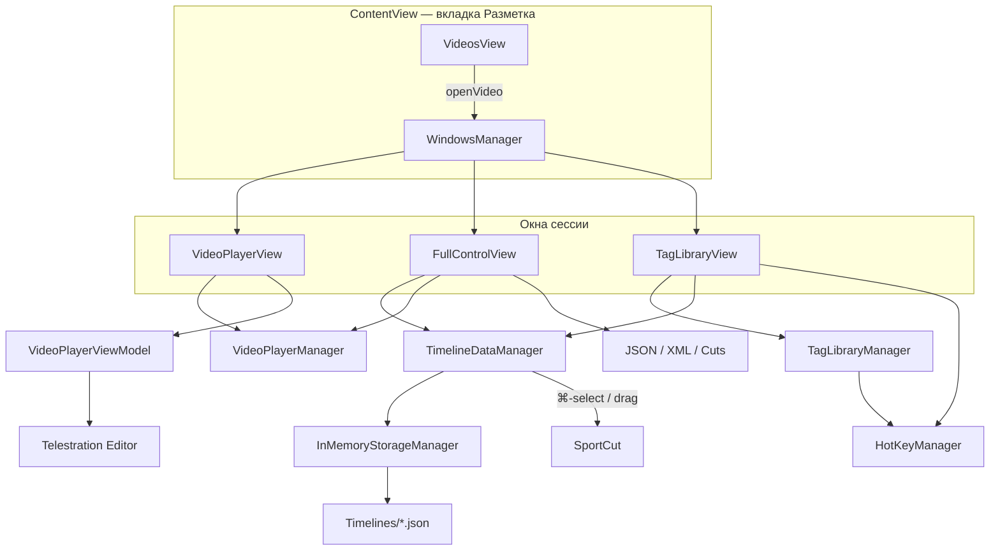

# Разметка видео

Документация по вкладке **Разметка**: добавление тегов на видео, работа с таймлайном, коллекциями, картой поля, телестрацией и экспортом.

> Режим коллекции **«Связки клавиш»** (свободный холст, связки между кнопками) описан отдельно: [KEY-BINDINGS.md](./KEY-BINDINGS.md).

---

## Содержание

1. [Обзор](#обзор)
2. [Вкладки приложения](#вкладки-приложения)
3. [Сессия разметки](#сессия-разметки)
4. [Библиотека тегов](#библиотека-тегов)
5. [Типы тегов и штампов](#типы-тегов-и-штампов)
6. [Лейблы и общие события](#лейблы-и-общие-события)
7. [Таймлайн](#таймлайн)
8. [Режимы разметки](#режимы-разметки)
9. [Воспроизведение видео](#воспроизведение-видео)
10. [Карта поля](#карта-поля)
11. [Телестрация и рисунки](#телестрация-и-рисунки)
12. [Горячие клавиши](#горячие-клавиши)
13. [Связь с просмотром (SportCut)](#связь-с-просмотром-sportcut)
14. [Экспорт](#экспорт)
15. [Хранение данных](#хранение-данных)
16. [Дополнительные окна](#дополнительные-окна)
17. [Архитектура (для разработчиков)](#архитектура-для-разработчиков)

---

## Обзор

**Разметка** — основной рабочий процесс аналитика в YouChip-Stat: просмотр видео, расстановка тегов на временной шкале, уточнение лейблами и событиями, привязка к позиции на поле, рисование поверх кадра.

Результат разметки — **таймлайны проекта**: набор линий (`TimelineLine`), каждая содержит **штампы** (`TimelineStamp`) с временным диапазоном, тегом, лейблами, событиями и опциональным комментарием.

```
Видеотека → открыть проект → 3 окна разметки
                                    │
                    ┌───────────────┼───────────────┐
                    ▼               ▼               ▼
              Видеоплеер      Таймлайн         Библиотека тегов
              (кадр)          (FullControl)    (TagLibrary)
```

---

## Вкладки приложения

| Вкладка | Назначение |
|---------|------------|
| **Разметка** | Библиотека видео → открытие проекта → сессия разметки |
| **Просмотр** | Сессии SportCut: плейлисты клипов, анализ уже размеченного материала |

Разметка и просмотр используют **общие данные таймлайна** проекта, но разный интерфейс. Из разметки можно отправить выбранные штампы в SportCut; из SportCut правки границ тегов сохраняются обратно в таймлайн проекта.

---

## Сессия разметки

### Открытие проекта

1. Вкладка **Разметка** → `VideosView` (список видео).
2. Клик по превью → `WindowsManager.openVideo(id:)`.
3. Загружаются таймлайны проекта, стартует видео, открываются три окна.

### Три основных окна

| Окно | Содержимое | Расположение по умолчанию |
|------|------------|---------------------------|
| **Видео** | `VideoPlayerView` — кадр, управление, редактор рисунков | Верхняя правая часть экрана |
| **Таймлайн** | `FullControlView` — шкала времени, штампы, экспорт | Нижняя часть (~40% высоты) |
| **Библиотека тегов** | `TagLibraryView` — коллекция, теги, события | Верхняя левая часть (~⅓ ширины) |

При открытии нового видео:
- таймлайны читаются из хранилища проекта;
- автоматически создаётся линия **«Рисунки»** (Drawings timeline) для скриншотов и телестрации;
- сбрасывается история баннера активности (`VideoMarkupActivityBanner`);
- возобновляется мониторинг горячих клавиш.

### Типичный рабочий цикл

1. Выбрать **коллекцию тегов** в библиотеке (стандартную или пользовательскую).
2. При необходимости включить **общие события** (чипы вверху библиотеки).
3. **Добавлять теги** кликом или hotkey во время просмотра.
4. Уточнять **лейблы** в листе выбора (если у тега есть группы лейблов).
5. **Редактировать** штампы на таймлайне: границы, лейблы, комментарии.
6. Опционально: **карта поля**, **скриншот + рисунок**, **зеркало видео**.
7. **Экспорт** разметки (JSON/XML) или нарезки (видео).
8. **Отправить в просмотр** — выбранные штампы → SportCut.

---

## Библиотека тегов

Файл: `TagLibraryView.swift`. Центральная панель для выбора коллекции и добавления тегов.

### Коллекции

| Тип | Источник | Редактор |
|-----|----------|----------|
| **Стандартные** | Встроенные JSON в `Resourses/BaseCollections/{вид спорта}/` | Не редактируются |
| **Пользовательские** | `~/Documents/YouChip-Stat/Collections/{id}/` | `CreateCustomCollectionsView` или `KeyBindingsCollectionEditorView` |

Последняя выбранная коллекция запоминается в `UserDefaults` (`lastSelectedCollection`).

### Два вида отображения библиотеки

| Вид | Когда | Интерфейс |
|-----|-------|-----------|
| **Групповой** | Стандартная коллекция или пользовательская без `tagLayout.json` | Список групп тегов + секция общих событий |
| **Холст (связки клавиш)** | Пользовательская коллекция с `displayMode == .free` и сохранённой раскладкой | `FreeTagsCanvasView` — см. [KEY-BINDINGS.md](./KEY-BINDINGS.md) |

### Элементы заголовка

- Переключатель коллекции (стандартные / пользовательские).
- Кнопка редактирования коллекции (для пользовательских).
- Масштаб библиотеки (0.75× – 1.5×).
- Индикатор загрузки при смене коллекции.

### Добавление тега (групповой режим)

1. **Пауза видео** (для мгновенных тегов).
2. Если у тега есть привязанные группы лейблов → открывается **лист выбора** (`StampItemsSelectionSheet`).
3. Вычисляется временной диапазон штампа.
4. Штамп добавляется на таймлайн.
5. Toast и запись в историю баннера (`VideoMarkupActivityBanner`).

При **live-разметке** время клика фиксируется до открытия листа лейблов (`pendingInstantTagAnchorTime`), чтобы подтверждение лейблов не сдвигало момент события.

---

## Типы тегов и штампов

### Мгновенный тег

- Условие: `tag.isInterval != true`.
- Один клик (или hotkey) → штамп с диапазоном вокруг текущего времени:

```
начало = currentTime − defaultTimeBefore
конец  = currentTime + defaultTimeAfter
```

Диапазон ограничивается длительностью видео.

### Интервальный тег

- Условие: `tag.isInterval == true`.
- **Первый клик** — начало записи интервала (`activeIntervalTags`), баннер показывает «идёт запись».
- **Второй клик** — конец интервала, диапазон `[startTime, currentTime]`.
- Затем лист лейблов (если есть группы) или сразу сохранение штампа.
- Отмена листа лейблов на интервале сбрасывает запись и возобновляет воспроизведение.

В режиме **связок клавиш** интервальный тег при старте **не ставит видео на паузу**; при остановке в групповом режиме по-прежнему может открываться лист лейблов.

### Штамп на таймлайне (`TimelineStamp`)

| Поле | Назначение |
|------|------------|
| `tagRefs` | Ссылки на тег(и) и группу |
| `timeStartSeconds` / `timeFinishSeconds` | Временной диапазон |
| `labels` | Выбранные лейблы с привязкой к группе |
| `timeEvents` | ID общих событий |
| `position` | Координаты на карте поля (если есть) |
| `comment` | Текстовый комментарий |
| `isActiveForMapView` | Показывать на карте поля |

### Штамп «Рисунки»

- Линия с фиксированным ID (`ScreenshotConstants.screenshotsTimelineID`).
- Всегда первая (или добавляется при открытии видео).
- Содержит скриншоты с телестрацией, привязанные к моменту видео.

---

## Лейблы и общие события

### Лейблы

- Организованы в **группы лейблов** внутри коллекции.
- У каждого тега в стандартном режиме — список `lablesGroup` (какие группы доступны при разметке).
- В режиме связок клавиш все группы лейблов привязаны ко всем тегам автоматически.

**Лист выбора** (`StampItemsSelectionSheet`):
- Открывается после нажатия тега (если есть группы лейблов) или при редактировании штампа на таймлайне.
- Поддерживает **hotkey лейблов** (`tag.labelHotkeys`) — пока лист открыт, `HotKeyManager` в режиме label-hotkey.

### Общие события (`TimeEvent`)

- Глобальные для коллекции метки (например, «1-й тайм», «Атака слева»).
- В групповом режиме: чипы вверху библиотеки, множественный выбор → прикрепляются к **следующему** добавляемому штампу.
- В режиме связок: кнопки на холсте или pending-набор в runtime.

---

## Таймлайн

Главный UI таймлайна — `FullControlView`. Отдельного окна «редактора таймлайна» нет: вся правка штампов происходит здесь.

### Структура данных

```
TimelineDataManager.shared
└── lines: [TimelineLine]
    ├── id, name
    ├── stamps: [TimelineStamp]
    └── tagIdForMode (в режиме tagBased — привязка линии к тегу)
```

### Элементы интерфейса

- **Горизонтальная прокрутка** и **масштаб** (pinch / контролы).
- **Сетка времени** с адаптивным шагом.
- **Плейхед** (`TimelinePlayheadView`) — позиция воспроизведения.
- **Строки** — по одной на линию таймлайна (`TimelineLineView`).
- **Штампы** — цветные блоки с именем тега; перетаскивание границ для изменения длительности.

### Редактирование штампа

| Действие | Как |
|----------|-----|
| Изменить начало/конец | Потянуть левый/правый край (минимум 0.5 с) |
| Выбрать штамп | Клик |
| Множественный выбор для SportCut | ⌘ + клик |
| Лейблы / события / комментарий | Двойной клик или контекстное меню |
| Удалить | Option + Delete (при выбранном штампе) |
| Перетащить в плейлист | Drag на окно SportCut |

Во время перетаскивания границы видео перематывается к соответствующему краю штампа.

### Баннер активности

`VideoMarkupActivityBanner` (оверлей на видео):
- Toast при добавлении тега / завершении интервала.
- Список **активных записей** интервальных тегов.
- **История** последних действий (вкл./выкл. в настройках, `VideoMarkupHistoryEnabled`).

### Блокировка таймлайна

Взаимодействие с таймлайном ограничено, когда:
- активен **режим редактора рисунков** на видео (`isEditorModeActive`);
- показывается полноэкранный скриншот.

---

## Режимы разметки

Переключаются в углу `FullControlView`. Хранятся в `UserDefaults` (`appMarkupMode`).

### По тегам (`tagBased`) — по умолчанию

- Каждый тег получает **свою линию** таймлайна (создаётся автоматически).
- Пользователь **не выбирает** линию вручную — штамп всегда попадает на линию соответствующего тега.
- `selectedLineID` обычно `nil`.

Подходит для спортивной аналитики, когда важна хронология одного типа события.

### Стандартный (`standard`)

- Пользователь создаёт **именованные линии** (`AddLineSheet`).
- Штампы добавляются на **выбранную** линию (`selectedLineID`).
- Линии можно переименовывать и удалять.

Подходит для свободной структуры (несколько тегов на одной линии, произвольная группировка).

При открытии проекта в стандартном режиме выбирается первая линия; в режиме по тегам — сброс выбора.

---

## Воспроизведение видео

Управляется синглтоном `VideoPlayerManager`.

### Обычный режим (файл)

- `AVPlayer`, стандартная шкала длительности.
- Пауза при добавлении мгновенного тега (в групповом режиме).

### Live-режим

- Поток через `LiveStreamManager`, без `AVPlayer`.
- `timelineDuration` включает буфер (+5 с за текущим временем).
- Подрежим **review** — отдельный плеер для перемотки записанного фрагмента трансляции.

### Элементы управления (FullControlView)

- Play / Pause.
- Скорость воспроизведения.
- Перемотка по клику на шкале (`TimelineTapToSeekGesture`).
- Режим live review (если доступен).

### Зеркало видео

`WindowsManager.toggleMarkupMirrorVideoWindow()` — дублирует окно видео для второго монитора.

---

## Карта поля

Для тегов с `mapEnabled == true` и коллекции с настроенным `PlayField`.

### При добавлении тега

1. После выбора лейблов (или сразу) открывается **окно выбора позиции** (`FieldMapSelectionView`).
2. Пользователь тапает по изображению поля.
3. Нормализованные координаты → `TimelineStamp.position`.
4. Основные окна **блокируются** на время выбора (`lockMainWindows`).

### Визуализация

`FieldMapVisualizationView` (отдельное окно из таймлайна):
- Точки штампов на поле.
- Фильтры по тегам, лейблам, событиям.
- Режим тепловой карты.
- Перемещение позиции штампа с карты.

### Настройка поля

- Изображение и размеры поля хранятся в `playField.json` коллекции.
- Редактор: `FieldMapConfigurationView` / `CollectionFieldMapEditorView` (в редакторе коллекции).
- Файлы изображений: `~/Documents/YouChip-Stat/PlayFields/`.

---

## Телестрация и рисунки

Телестрация встроена в **окно видео**, модуль `Telestration/`.

### Сценарий

1. Сделать **скриншот** текущего кадра (`VideoPlayerViewModel.takeScreenshot`).
2. Открывается **режим редактора** (`isEditorMode = true`):
   - панель инструментов: стрелки, зоны, полигоны, текст;
   - холст поверх кадра.
3. **Сохранить** → PNG + JSON-метаданные в папку скриншотов проекта.
4. На линию **«Рисунки»** добавляется штамп с привязкой к `videoTime`.
5. При прохождении плейхеда через момент скриншота (±0.15 с) рисунок показывается поверх видео.

### Связь со штампом тега

Если изменить временной диапазон родительского штампа так, что рисунок «выпадает» из интервала — появляется уведомление об отвязке (`unlinkedScreenshotPopups`).

### Горячие клавиши в редакторе

- Enter — применить.
- Cmd+C / Cmd+V / Cmd+Z — копировать / вставить / отменить.
- Shift+←/→ — перемотка ±3 с (даже в редакторе).

Выход из редактора восстанавливает размер окна видео и снова включает hotkey тегов.

---

## Горячие клавиши

Файл: `HotKeyManager.swift`. Активны, когда фокус на окне разметки (`ActiveWindowManager`).

### Воспроизведение

| Клавиша | Действие |
|---------|----------|
| **Space** | Play / Pause |
| **Shift + ←** | −3 секунды |
| **Shift + →** | +3 секунды |

### Теги

- Назначаются в коллекции (`tag.hotkey`).
- Срабатывают как клик по тегу → тот же путь (лист лейблов, интервал и т.д.).

### Лейблы

- Назначаются per-tag: `tag.labelHotkeys[labelId]`.
- Работают **только при открытом листе выбора лейблов**.

### Режим связок клавиш

| Клавиша | Действие |
|---------|----------|
| **Esc** | Сброс подсветки связки |
| **highlightHotkey** связки | Нажатие подсвеченной кнопки без мыши |

### Блокировка

Hotkeys отключаются при:
- открытом редакторе коллекции;
- фокусе в текстовом поле;
- большинстве модальных окон (кроме листа лейблов для label-hotkeys).

---

## Связь с просмотром (SportCut)

| Направление | Механизм |
|-------------|----------|
| Разметка → новая сессия SportCut | Панель bulk-selection на таймлайне, ⌘-выбранные штампы |
| Разметка → существующий плейлист | Drag штампов или «добавить в открытый плейлист» |
| Штамп → событие SportCut | `SportCutEvent.from(stamp:line:source:)` |
| Комментарии | `stamp.comment` переносится в `eventComments` плейлиста |
| SportCut → разметка | Правка границ в панели разметки SportCut → `persistProjectTimelinesForMarkupModel` |

Вкладка **Просмотр** (`SportCutListView`) — список сессий. Окно SportCut, открытое из разметки, — мост к тому же проекту по `projectID`.

---

## Экспорт

### Данные разметки (меню Tools)

Доступно при активной сессии разметки (`FullControlView` обрабатывает уведомления):

| Пункт | Содержимое | Shortcut |
|-------|------------|----------|
| **JSON Full** | Обогащённые таймлайны с метаданными тегов/лейблов | ⌘E |
| **JSON Simple** | Сырой массив `[TimelineLine]` | — |
| **XML** | Формат Sportscode (`<ALL_INSTANCES>`) | ⌘I |

### Нарезки видео (Tools → Export Cuts)

Типы (`ExportHelper`, `CutsExportType`):

- текущий таймлайн;
- все таймлайны;
- линия рисунков;
- по тегам;
- по лейблам;
- по событиям;
- скриншоты.

Режимы: один фильм или отдельный файл на сегмент; опционально водяной знак и оверлей скриншота.

### Экспорт / импорт проекта

- `ProjectExportManager` — пакет проекта целиком.
- `SportcodeXMLProjectImporter` — импорт XML Sportscode.

---

## Хранение данных

### Проекты (видеотека)

| Данные | Где |
|--------|-----|
| Список проектов | `UserDefaults` → `videosData` (`[VideosData]`) |
| Security-scoped bookmarks | Внутри `VideosData` |
| Избранное, переименования | `VideosData` |

### Таймлайны (ядро разметки)

| Слой | Путь |
|------|------|
| Кэш (малые проекты) | `UserDefaults` → `timeline_{videoId}` |
| Файл (крупные) | `~/Documents/YouChip-Stat/Timelines/{videoId}.json` |
| Запись | `TimelineDataManager.updateTimelines()` → `InMemoryStorageManager` |
| Сброс на диск | Debounce 30 с + при завершении приложения |

### Скриншоты и телестрация

```
~/Documents/Screenshots/{projectId}/
├── {name}.png
└── {name}.json
```

Метаданные загружаются в `ScreenshotsMetadataManager` при открытии сессии.

### Коллекции тегов

```
~/Documents/YouChip-Stat/Collections/{collectionId}/
├── tags.json
├── tagGroups.json
├── labels.json
├── labelGroups.json
├── timeEvents.json
├── playField.json
└── tagLayout.json          # только для режима «Связки клавиш»
```

Закладки коллекций: `CollectionsBookmarks.json`.

### Резервное копирование

`DataSyncManager` зеркалирует `Documents/YouChip-Stat/` в  
`~/Library/Application Support/YouChip-Stat-Backup/`.

Удалённые проекты: таймлайны могут сохраняться как «осиротевшие» (`OrphanedTimelinesManager`).

### Настройки, влияющие на разметку

| Ключ | Назначение |
|------|------------|
| `appMarkupMode` | `standard` / `tagBased` |
| `lastSelectedCollection` | Последняя коллекция |
| `VideoMarkupHistoryEnabled` | История в баннере активности |
| Масштаб библиотеки | Per-collection в UserDefaults |

---

## Дополнительные окна

Открываются из меню или кнопок во время разметки (`WindowsManager`):

| Окно | Назначение |
|------|------------|
| Зеркало видео | Дубликат плеера |
| Карта поля (выбор точки) | Позиция штампа при добавлении |
| Карта поля (визуализация) | Аналитика по позициям |
| Настройка поля | Редактирование play field |
| Аналитика | `AnalyticsView` |
| Галерея скриншотов | Просмотр сохранённых кадров |
| Review video | Просмотр записи live-трансляции |
| Момент | Превью клипа по штампу |
| Органайзер (`ViewerView`) | Экспорт клипов из текущего проекта |
| Редактор коллекции | Создание/правка тегов и раскладки |
| SportCut | Плейлист из выбранных штампов |

При закрытии всех окон (`closeAll`) hotkeys сбрасываются, live-сессия завершается, временные файлы удаляются.

---

## Архитектура (для разработчиков)

### Диаграмма сессии разметки



### Ключевые файлы

| Область | Путь |
|---------|------|
| Точка входа, вкладки | `Youchip_StatApp.swift` |
| Видеотека | `Modules/Videos/Views/VideosView.swift` |
| Окна | `Modules/VideoPlayer/Managers/WindowsManager.swift` |
| Таймлайн (данные) | `Modules/VideoPlayer/Managers/TimelineDataManager.swift` |
| Таймлайн (UI) | `Modules/VideoPlayer/Views/FullControlView.swift` |
| Строки штампов | `Modules/VideoPlayer/Views/TimelineLineView.swift` |
| Библиотека тегов | `Modules/VideoPlayer/Views/TagLibraryView.swift` |
| Видео + редактор | `Modules/VideoPlayer/Views/VideoPlayerView.swift` |
| Воспроизведение | `Modules/VideoPlayer/Managers/VideoPlayerManager.swift` |
| VM редактора | `Modules/VideoPlayer/ViewModel/VideoPlayerViewModel.swift` |
| Hotkeys | `Modules/VideoPlayer/Managers/HotKeyManager.swift` |
| Режим разметки | `Modules/VideoPlayer/Models/MarkupMode.swift` |
| Модель штампа | `Modules/VideoPlayer/Models/TimelineStamp.swift` |
| Коллекции | `Modules/VideoPlayer/Managers/TagLibraryManager.swift` |
| Лист лейблов | `Modules/VideoPlayer/Views/Sheets/StampItemsSelectionSheet.swift` |
| Карта поля | `Modules/VideoPlayer/Views/FieldMapVisualizationView.swift` |
| Экспорт | `Modules/VideoPlayer/Helpers/ExportHelper.swift` |
| Баннер активности | `Modules/VideoPlayer/Managers/VideoMarkupActivityBanner.swift` |
| SportCut | `Modules/SportCut/Views/SportCutListView.swift` |
| Персистентность | `Common/Managers/InMemoryStorageManager.swift` |
| Проекты | `Common/Files/Helpers/VideoFilesManager.swift` |
| Уведомления | `Modules/VideoPlayer/Models/NSNotification + Convenience.swift` |

### Основные синглтоны

| Синглтон | Роль в разметке |
|----------|-----------------|
| `TimelineDataManager.shared` | Линии и штампы, выбор, сохранение |
| `VideoPlayerManager.shared` | Время, play/pause, длительность |
| `TagLibraryManager.shared` | Активная коллекция, теги, лейблы |
| `HotKeyManager.shared` | Глобальные hotkeys сессии |
| `WindowsManager.shared` | Жизненный цикл окон |
| `KeyBindingRuntimeManager.shared` | Только режим связок клавиш |

### Связанная документация

- [KEY-BINDINGS.md](./KEY-BINDINGS.md) — связки клавиш, редактор коллекции `.free`, runtime на холсте.
- [CLAUDE.md](../CLAUDE.md) — общая архитектура приложения, сборка, модули.

---

*Документ актуален для кодовой базы Youchip-Stat. При изменении UX разметки или модели данных обновляйте этот файл вместе с кодом.*
